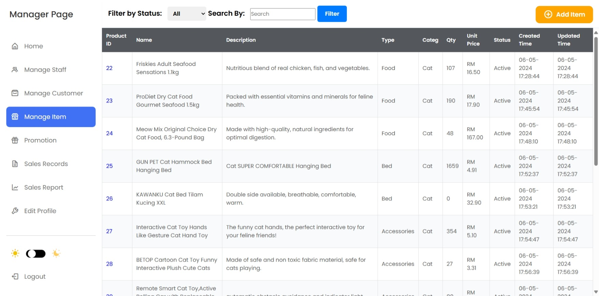
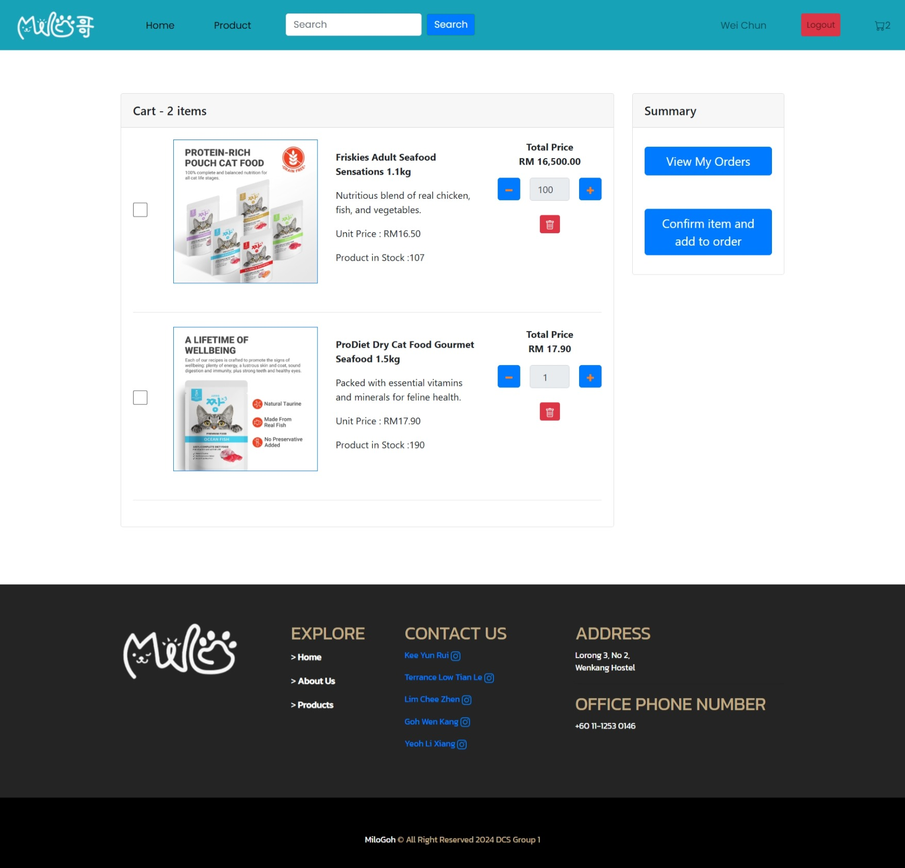
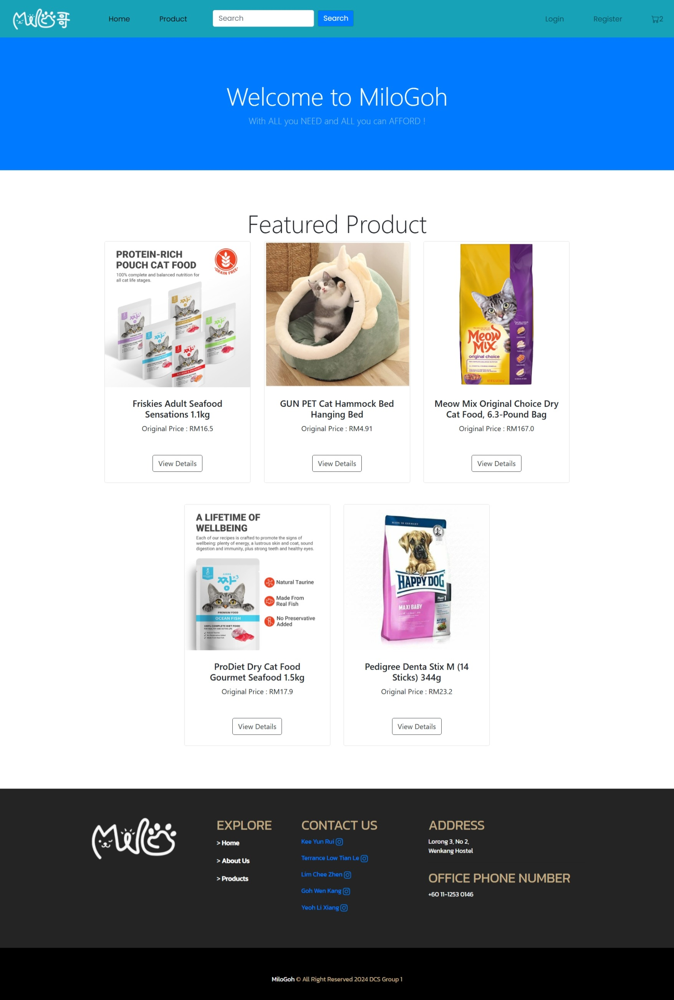
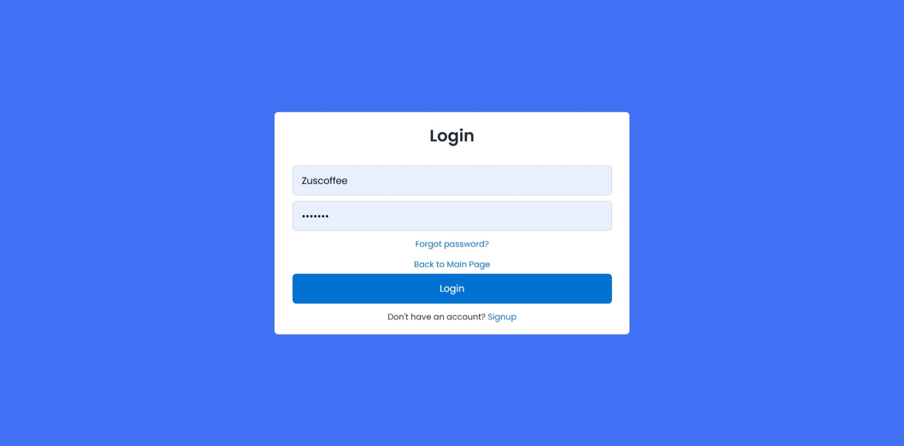
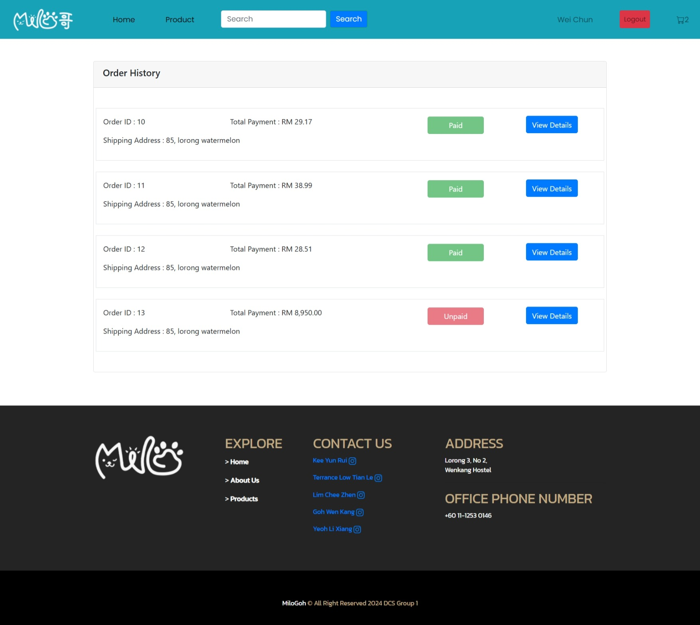
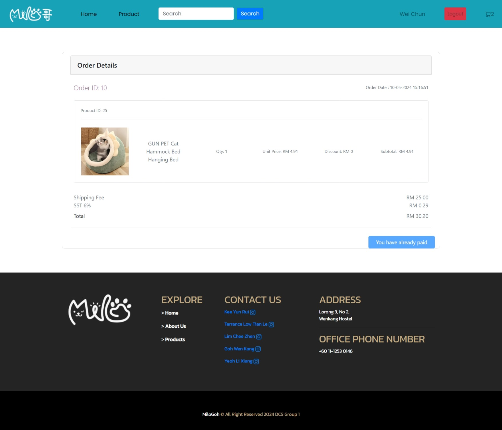
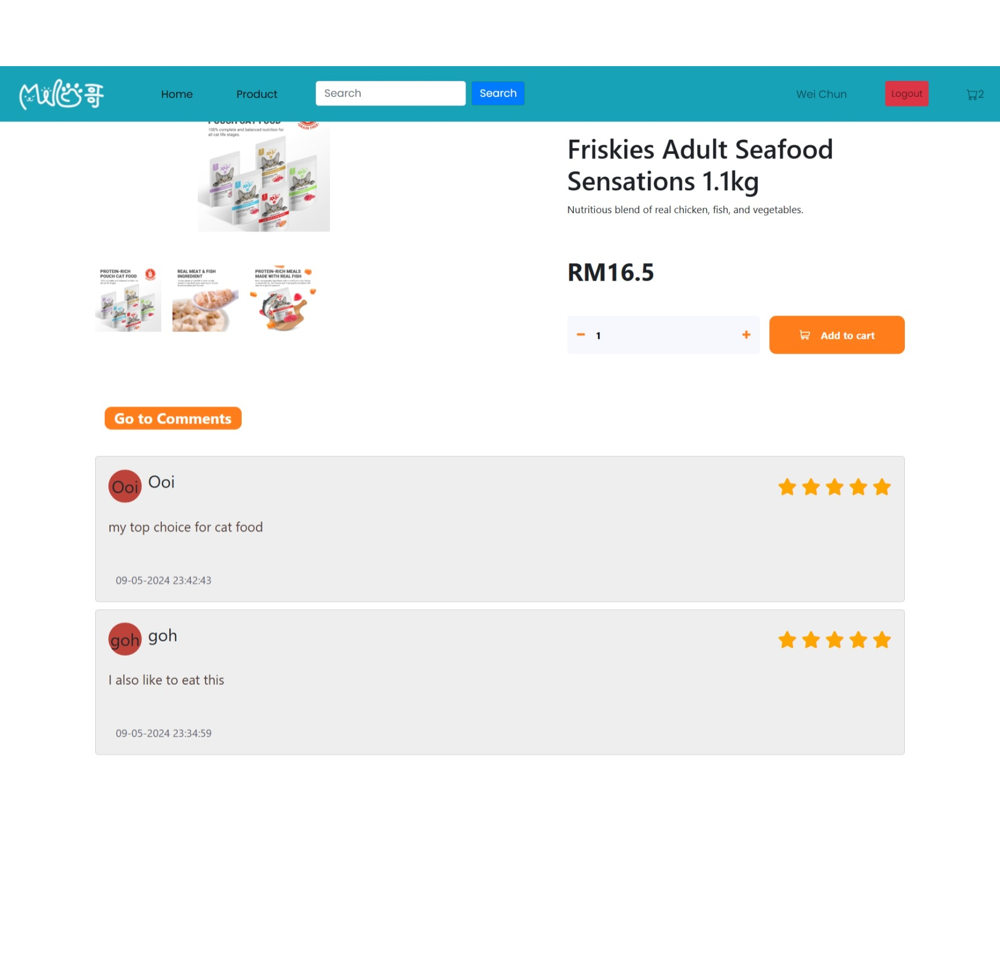
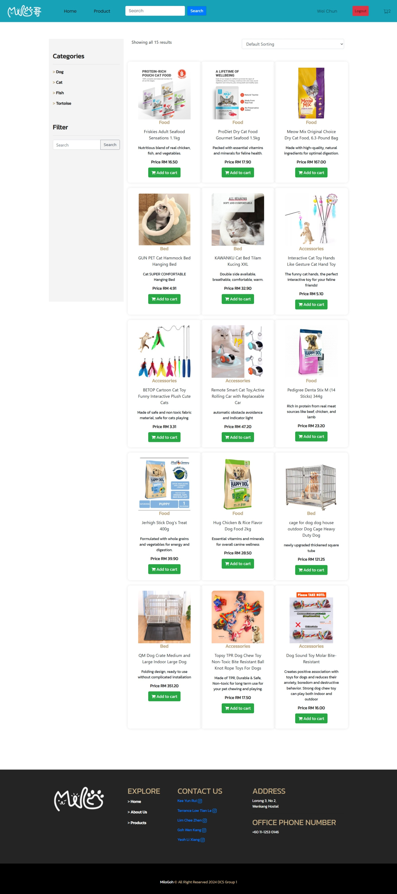
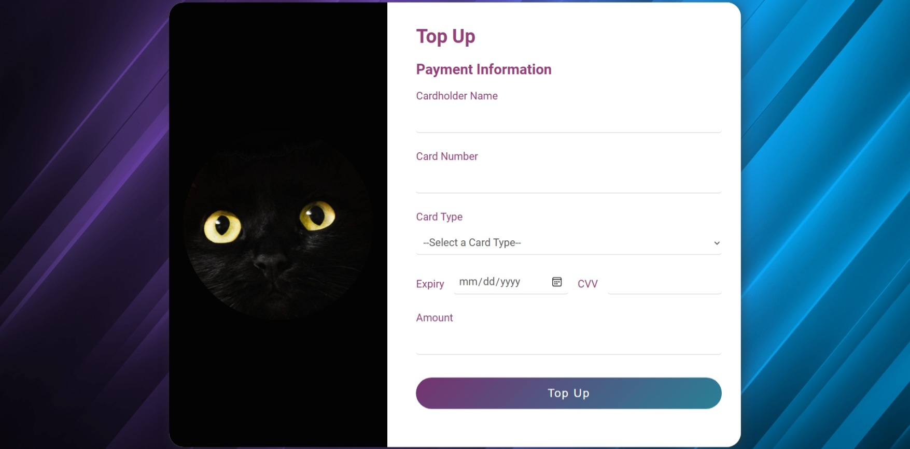

# Project Title

This project is a web application, likely an e-commerce or product management system, developed using Java (Servlets, JSP, JPA) and a Derby database. It features functionalities for user accounts, product management, shopping cart, order processing, payments, and reviews.

## UI Outputs

Here are some screenshots of the application's user interface:

*   
*   
*   
*   
*   
*   
*   
*   
*   

## Installation

### GlassFish Server for the connection pools
- Download `GlassFish_Server.zip` and extract it to:
  `C:\Users\UserName\GlassFish_Server`
  (Zip your original `GlassFish_Server` as backup before overwriting it)

### Database
- Download `milogoh.zip` from Database folder and extract it to:
  `C:\Users\zlsy2\AppData\Roaming\NetBeans\Derby`

### Source Code
- Download `MiloGoh.zip` from Source Code folder and extract it to:
  `\Desktop`

## Starting the Project

### After extracting the source code to desktop
1. Open Apache NetBeans IDE 18 and open MiloGoh in NetBeans
2. Right click MiloGoh and click "Run"

**IMPORTANT: First Time Running the Project**

### Project stuck at "https://localhost:8080/startupServlet"
- The project sometimes takes too long on first run and eventually requests time out.
- Close the project and run the project again if the project stuck at `startupServlet` for about 5 seconds.

## Sample Accounts

### Manager (only one account and fixed)
- username: `lengzaiNick`
- password: `Ylx123@`

### Staff
- username: `terrance`
- password: `Tltl123@`

### Rich Customer (Rich wallet)
- username: `keeyunrui2004`
- password: `Kee2004$$`

### Poor Customer (Poor wallet)
- username: `milokang`
- password: `Test123@`

**IMPORTANT: Guest Cart Feature**

### Permanent Local Cart
- The data of guest cart will not disappear even if the user closes the project.

## Creators

### Team Members
The project is created by:
- Kee Yun Rui
- Goh Wen Kang
- Terrance Low Tian Le
- Yeoh Li Xiang
- Lim Chee Zhen
